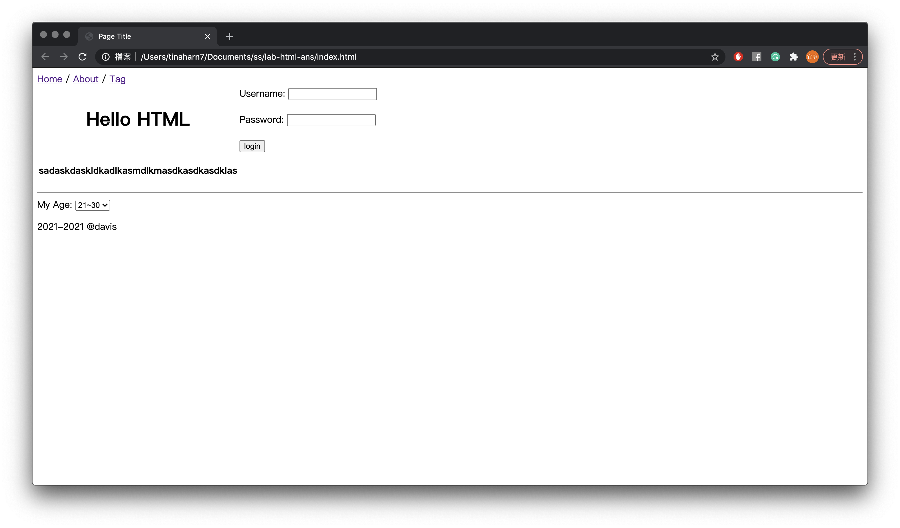
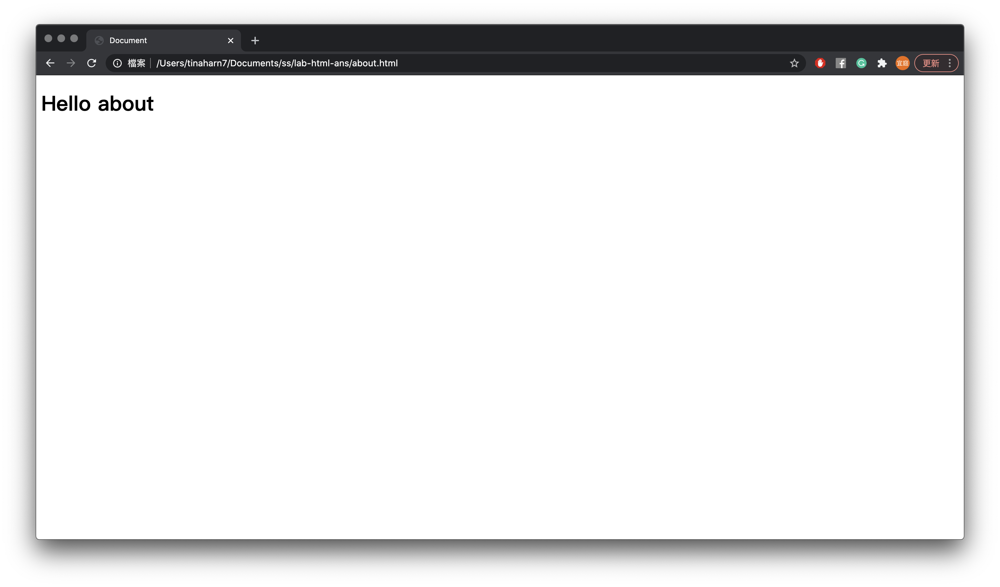

# Lab2 - html
We will learn how to create an HTML page in this lab. The final result will be like the image below:

## Grading
#### 1. Home/About/Tag (20%)
* You will need to create a header on the top of the page (10%)
* "About" should link to another page (10%)

#### 2. Create a table (60%)
* Title - Hello HTML (20%)
* Username and password (20%)
   * After clicking the "login" button, you should show the username and password in the URL
   
* Paragraph (20%)
   * Type whatever you want!
#### 3. Selector (20%)
* Select different ages
